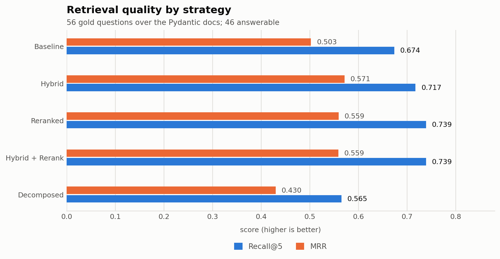
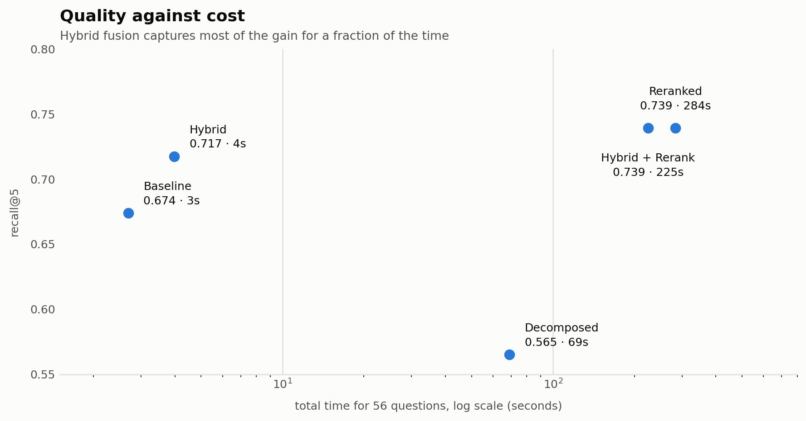
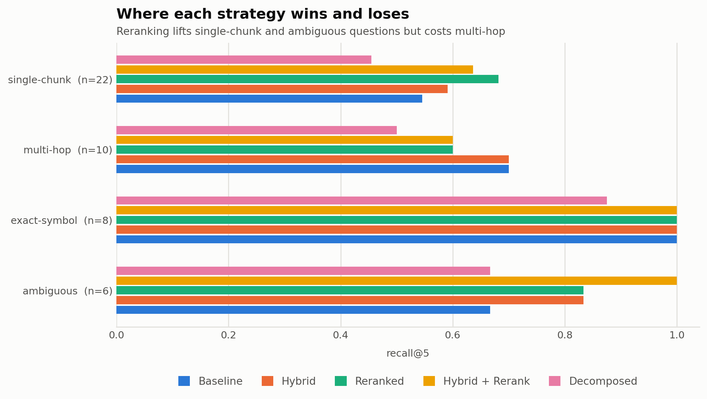

# RAG Evaluation on the Pydantic Docs

A small, honest benchmark that answers one question: **when you add the popular
retrieval tricks to a RAG system, do they actually help?**

Most RAG tutorials bolt on a reranker or a query rewriter and declare victory
without measuring anything. This project builds five retrieval strategies over the
same corpus, scores them against a hand-written question set, and saves every run
so the numbers can be checked.

The short answer: **two of the five tricks helped, one actively hurt, and the most
expensive option was not the best one.**

---

## Results



Hybrid search and reranking both beat plain vector search. Query decomposition,
the only strategy that calls an LLM during retrieval, came out **worst on every
metric** while also being the only one that costs money to run.



Cost is where the picture changes. Reranking buys the top score but takes roughly
**70x longer** than hybrid search for **two extra percentage points** of recall.
Hybrid fusion sits in the sweet spot, and it also posts the best MRR, meaning it
puts the right chunk nearer the top of the list.



Breaking the score down by question type shows the trade the headline number
hides: **reranking helps most categories but makes multi-hop questions worse**,
dropping them from 0.700 to 0.600.

| Strategy | Recall@5 | MRR | single-chunk | multi-hop | exact-symbol | ambiguous | Time (56 q) |
|---|---|---|---|---|---|---|---|
| Baseline (dense only) | 0.674 | 0.503 | 0.545 | 0.700 | 1.000 | 0.667 | 2.7s |
| Hybrid (dense + BM25) | 0.717 | **0.571** | 0.591 | 0.700 | 1.000 | 0.833 | 4.0s |
| Reranked | **0.739** | 0.559 | **0.682** | 0.600 | 1.000 | 0.833 | 283.5s |
| Hybrid + Reranked | **0.739** | 0.559 | 0.636 | 0.600 | 1.000 | **1.000** | 224.6s |
| Decomposed | 0.565 | 0.430 | 0.455 | 0.500 | 0.875 | 0.667 | 69.0s |

Regenerate the charts and this table from the saved runs with `python eval/plots.py`.

### What the numbers say

- **Hybrid search is the best value.** Adding a keyword index to vector search
  costs about a second and a half across the whole question set and gains four
  points of recall plus the best MRR of any strategy.
- **Reranking is expensive and not free of downsides.** It wins on raw recall but
  costs roughly five seconds per question, and it loses multi-hop questions that
  plain vector search got right. The saved regression report names both.
- **Query decomposition made things worse.** Splitting a question into
  sub-questions scattered the retrieval, and it is also the only non-reproducible
  strategy here, scoring 0.565 and 0.609 on two separate runs because the LLM
  splits the question differently each time.
- **Exact-symbol questions are already solved.** Every strategy except decomposition
  scores a perfect 1.000 there. When a question names a real API symbol, plain
  vector search finds it, so that category has no headroom left to win, and
  decomposition manages to lose ground on it.

---

## How it works

Documents flow through four stages. Each is a script you can run on its own.

```
data/raw_docs/*.md
        │  pipeline/ingest.py      split on headings, cap chunk size
        ▼
index/chunks.jsonl                701 chunks
        │  pipeline/embed.py       MiniLM embeddings  → index/faiss.index
        │  pipeline/bm25.py        tokenised corpus   → index/bm25.pkl
        ▼
pipeline/retrieval.py             five strategies, all returning ranked chunk ids
        │
        ▼
pipeline/eval.py                  score against the gold set → results/
```

**The five strategies**, all defined in `pipeline/retrieval.py`:

| Strategy | What it does |
|---|---|
| Baseline | Vector search over MiniLM embeddings with a FAISS inner-product index |
| Hybrid | Vector and BM25 results merged with reciprocal rank fusion |
| Reranked | Top 20 vector hits re-scored by a cross-encoder, best 5 kept |
| Hybrid + Reranked | The fused shortlist re-scored by the same cross-encoder |
| Decomposed | An LLM splits the question, each part is searched, results interleaved |

There is also a **CRAG-style agent** in `pipeline/agent.py`: a LangGraph state
machine that retrieves, grades whether the passages are sufficient, and then either
answers, rewrites the query and tries once more, or refuses. It is implemented and
runnable but is not part of the ablation table above, because its output is a
judgement rather than a ranking.

### Models

| Role | Model |
|---|---|
| Embeddings | `all-MiniLM-L6-v2` (384 dims, runs locally) |
| Reranker | `cross-encoder/ms-marco-MiniLM-L-6-v2` (runs locally) |
| Generation, grading, decomposition | `gpt-4o-mini` (API) |

Only decomposition and the agent need the API. The four other strategies run
entirely on your machine.

---

## The question set

`data/gold_questions.jsonl` holds 56 hand-written questions, 46 of which have an
answer in the docs. Each records the chunk ids a correct answer must draw on.

| Category | Count | What it tests |
|---|---|---|
| single-chunk | 22 | An ordinary question answered by one passage |
| multi-hop | 10 | Needs two passages; neither alone is enough |
| unanswerable | 10 | Sounds plausible, but the docs never cover it |
| exact-symbol | 8 | Names a real API symbol, testing rare-token matching |
| ambiguous | 6 | Vague, casual phrasing that avoids the documented term |

The questions deliberately avoid reusing their source passage's wording, so a
system cannot win by keyword overlap alone. The unanswerable ones are the
interesting case: they sit close to real content, so a careless system will
confidently retrieve something tangential and hallucinate an answer.

Verify every id still resolves against the corpus with `python eval/verify_gold.py`.

---

## Running it

Requires Python 3.10+.

```bash
pip install sentence-transformers faiss-cpu rank-bm25 nltk openai langgraph python-dotenv matplotlib
```

Copy `.env.example` to `.env` and add your key (only needed for the decomposed
strategy, the generator and the agent):

```bash
cp .env.example .env
```

Build the index, then evaluate. Run everything from the project root:

```bash
python pipeline/ingest.py     # markdown  → chunks
python pipeline/embed.py      # chunks    → FAISS index
python pipeline/bm25.py       # chunks    → BM25 index
python pipeline/eval.py       # score all five strategies
```

`eval.py` takes strategy-name prefixes, which is useful for skipping the one that
costs money:

```bash
python pipeline/eval.py Baseline Reranked Hybrid   # the four local strategies
python pipeline/eval.py Decomposed                 # the one that calls the API
python pipeline/eval.py --no-save                  # print only, write nothing
```

Try a single query interactively:

```bash
python pipeline/retrieve.py "how do I make a model immutable?"
python pipeline/rerank.py   "how do I make a model immutable?"
python pipeline/generate.py "how do I make a model immutable?"
```

### What a run saves

Each strategy writes its own folder the moment it finishes, so a failure late in a
run never loses completed work:

```
results/<strategy>_<run_id>/
├── traces.jsonl    one row per question: retrieved ids, recall, reciprocal rank, latency
└── summary.json    aggregate metrics + the models, k values and corpus size used
```

The metadata matters. Chunk ids change if you re-chunk the corpus, so a results
folder is only interpretable alongside the settings that produced it.

---

## Layout

```
data/raw_docs/          85 markdown files from the Pydantic docs
data/gold_questions.jsonl   the hand-written question set
index/                  generated chunks and search indexes
pipeline/
  config.py             all paths, model names and defaults
  ingest.py  embed.py  bm25.py      build the indexes
  retrieval.py          the five strategies
  llm.py                OpenAI client, prompting, context building
  decompose.py  generate.py  agent.py
  eval.py               scoring, metrics and persistence
eval/
  plots.py              regenerates the charts in this README
  verify_gold.py        checks every gold chunk id still exists
results/                saved runs
docs/images/            the charts
```

`index/faiss.index`, `index/bm25.pkl` and `index/chunk_ids.json` are generated and
gitignored. Rebuild them with `embed.py` and `bm25.py`.

---